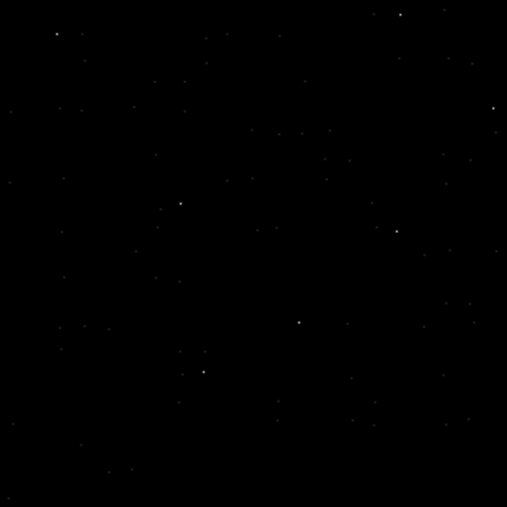

# 🌟 Star Cipher

Star Cipher hides messages in BMP images using star patterns. Encode secret texts using a password-based pattern system that only the decoder can reveal.

## 🛠️ Build

```bash
make
```

## 🚀 Usage

### Encode:

```bash
./bin/star_cipher -e -m "Hello World" -p mypass -o out.bmp
```

### Decode:

```bash
./bin/star_cipher -d -i out.bmp -p mypass
```

## 📁 Structure

- `src/` - Source code
- `bin/` - Compiled binaries

## 🧪 Example Output

 <p align="center"> </p>

## 📜 License

This project is licensed under the GNU General Public License v3.0.
